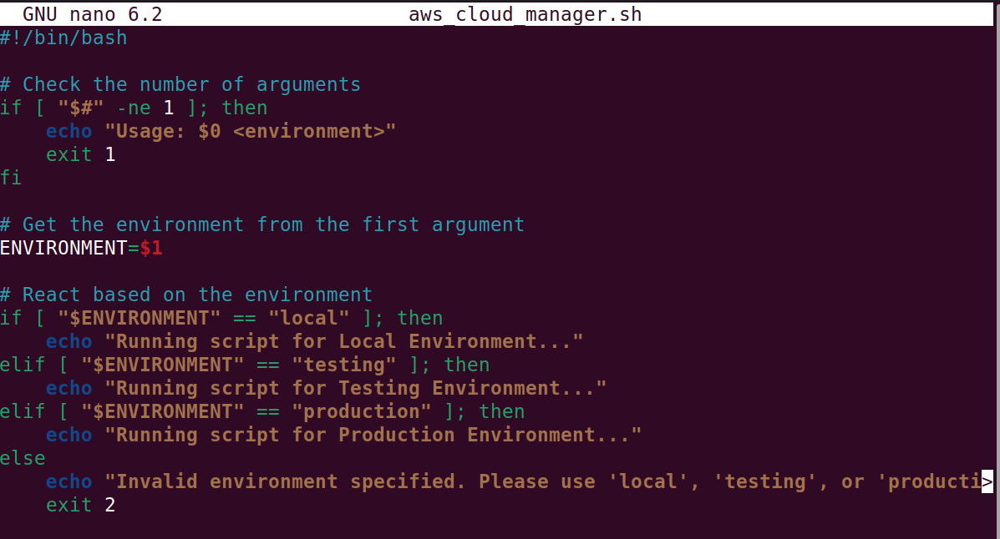
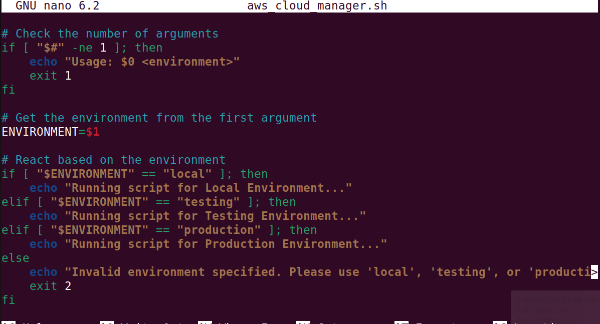
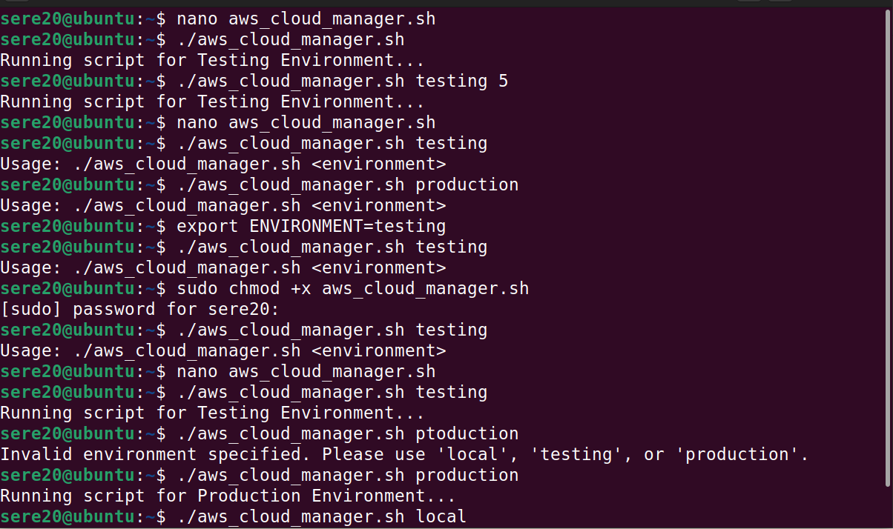

# Environment-variable
A summary of my learnings from the mini project.

The examples in the mini project illustrate how environment variables and scripts can be used to manage multiple environments effectively. A shell script, `aws_cloud_manager.sh`, is created to dynamically adjust behavior based on the specified environment, such as *local, testing, or production*. By setting environment variables like **ENVIRONMENT=testing** or using command-line arguments (e.g., `./aws_cloud_manager.sh testing`), the script can execute environment-specific commands without hardcoding values. Best practices, such as checking argument counts and validating inputs, ensure the script is robust and adaptable. These examples provide a practical understanding of how to manage configurations across environments efficiently.

### Terminal Output

### Scripts in Action

### Final Result
